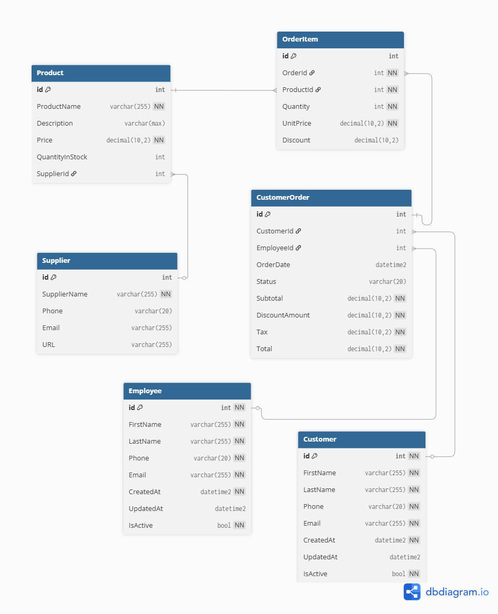

# TechStop-Database

**SQL Server database schema for a small business inventory and sales system**, designed for future integration with a .NET web application.  
This database models products, suppliers, customers, employees, orders, and order items.

---

## Features

- Normalized relational schema with foreign keys
- Support for inventory tracking, customer orders, and supplier management
- Unique constraints and indexes for data integrity
- Ready for future expansion (e.g., triggers, stored procedures, reporting)

---

## Prerequisites

- SQL Server 2019+ (or Azure SQL)
- SQL Server Management Studio (SSMS) 19+

---

## Project Structure

docs/
TechStop.png # ERD image
TechStop_DB_ERD.pdf # ERD PDF
TechStop.dbml # dbdiagram.io source
sql/
01_create_database.sql
02_create_tables.sql
03_insert_sample_data.sql # (coming soon)
04_create_indexes.sql # (coming soon)

## Setup / How to Run

Requires SQL Server + SSMS.

1. Run scripts in order from the `/sql` folder:

   - `01_create_database.sql`
   - `02_create_tables.sql`

2. ER Diagram
   

3. Schema source (dbdiagram)
   See [`docs/TechStop.dbml`](docs/TechStop.dbml).

## Current Status

- [x] Database created (`TechStop`)
- [x] Core tables created (Supplier, Product, Customer, Employee, CustomerOrder, OrderItem)
- [ ] Sample data
- [ ] Indexes
- [ ] Views / Stored Procedures / Triggers

## Notes

- Money fields use `DECIMAL(10,2)`.
- `CustomerOrder` & `OrderItem` names avoid T-SQL reserved words.

```

```
